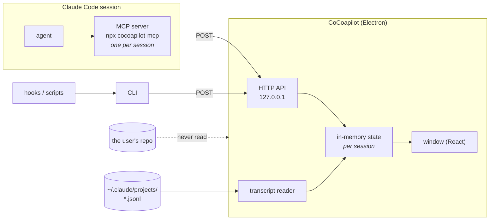

# Architecture

**Status:** draft, for review. **Written:** 2026-08-06, against decisions 1–27.

[STATUS.md](../../STATUS.md) is the decision log — every choice here is numbered
there with its rationale and its cost. This document is the synthesis: what the
system *is*, for someone who has not read all 27.

The companion document is [push-schema.md](push-schema.md), which specifies the
contract this describes.

## What it is

A desktop board that sits beside an editor while an AI agent works a Spec-Kit
repository. The agent reports what it is doing; a human watches. It holds the
information a developer would otherwise track in their head across a long agent
session.

## The defining property: it is a display panel

Almost everything below follows from one idea. CoCoapilot **reads nothing from
the user's repository, writes nothing anywhere, and owns no durable state**
(decisions 11, 21, 24). Everything on screen either arrived in a push or was
read from Claude Code's own session transcript.

That is a severe constraint, and it is deliberate. What it buys:

| Not in this system | Because |
|---|---|
| A database, migrations, a storage format | Nothing survives closing the window (21). |
| A Spec-Kit parser | We never open a file in the repo (24). |
| A file watcher, a polling loop | The AI drives the screen; the window never refreshes itself (12). |
| Auth, TLS, a session store | Bound to `127.0.0.1` only (18). |
| Conflict resolution, write ownership | Nothing is ever written to the repo (11). |
| Reconciliation between sources | The push is the only authority (16, 24). |

The cost is equally blunt: **the board is only as correct as the agent.** No
independent source remains to notice a stale or wrong report. That trade is the
architecture.

## Processes and lifetimes

Four processes, three lifetimes, and the mismatch between them is the reason the
system is shaped the way it is.

**The Electron main process** owns everything: the in-memory state, the HTTP
API, the transcript reader. Node in the main process is precisely why Electron
was chosen over Tauri (decision 3) — no sidecar, no second language.

**The MCP server** is *not* part of the app. Claude Code spawns it as its own
child process, one per session, so it can never share memory with the board
(decision 6). It is a thin HTTP client shipped via npx (27).

Two consequences that are easy to get wrong:

- It must **start cleanly whether or not the app is running**, and connect
  lazily per call. Claude Code discovers an MCP server's tool list once, at
  session start; a server that fails at init because the board is closed leaves
  the tools missing for that entire session, including after the user opens the
  board two minutes later.
- When a call cannot reach the board it **fails soft and says so plainly** —
  *"CoCoapilot board is not running — continue working, no need to retry."* A
  monitoring tool that derails the work it monitors is worse than none.

**The CLI** is the same package, for hooks and scripts. Short-lived, stateless.

**Finding each other:** the app claims a fixed port and walks a short range if
taken; clients probe the same sequence and use the first that identifies itself
at `GET /v1/health` (22). Matching on the response payload rather than on the
connection succeeding is load-bearing — a range probe knocks on ports owned by
unrelated software, and prompt text must not be POSTed into some other program.

## Where information comes from

Exactly two sources.

**1. Pushes** (`POST /v1/push`) carry the whole board: feature, stories, tasks,
plan, focus, changed files. Each push is a **full snapshot that replaces** what
the board held for that session (26). Idempotent and self-healing — a dropped,
duplicated or out-of-order push costs nothing because the next is authoritative.
That matters more than usual here, since no repo read remains to correct a
board that drifted.

Notes (`POST /v1/note`) are the single exception: they **append** (20). Folding
them into the snapshot would force an agent to resend every note it had ever
written to add one.

**2. Claude Code's transcripts**, tailed live from `~/.claude/projects/<slug>/`,
feed three sections — *Last prompt*, *History*, *In context* (10). No other
source could: an agent cannot honestly self-report its own prompt history or
token counts. The transcript directory is keyed by a slug of the project path,
so a pushed `repo` resolves to exactly one transcript folder with no config.

The slug rule is **every character that is not `[A-Za-z0-9]` becomes `-`**, case
preserved. *Which* file inside it comes from `CLAUDE_CODE_SESSION_ID`, reported
by the clients as one optional envelope field — the board's own `sessionId` is a
`randomUUID()` and never matches a transcript filename. Without that field the
reader falls back to the newest `.jsonl` in the directory, which is right
whenever one session is running in a repository and is stated as the heuristic
it is.

Exactly one file, and never more: not the sibling session's transcript in the
same directory, and not the `<sessionId>/subagents/` tree beneath it — an
agent's internal delegation is not the developer's instructions. That is
asserted rather than intended, by recording every `node:fs` call across a full
read cycle and requiring the set of paths touched to be exactly the one located
transcript.

The format is undocumented and unstable — a ninth record type appeared between
two samples taken a day apart — so the reader is built to degrade rather than
break. Three states, never two: `available`, `empty` (read fine, nothing in it)
and `unreadable` (could not read at all), drawn differently, because a section
that failed and a section with nothing to show are different claims.

Tailing counts as *the AI updating the board*, not the window refreshing itself.
The distinction that matters is whose file we follow: the one the AI writes,
yes; the repository and git, no (12).

Because the transcript is on disk, history survives a restart and the board can
show what happened while it was closed. It is also the only thing that does —
everything else starts empty on every launch.

## State

In memory, keyed by `(repo, sessionId)`, and gone when the app closes.

- **Sessions accumulate.** Every session that has declared itself is held; the
  board shows one at a time, with a switcher that is absent at one session and
  appears at two (14). Pills sit in declaration order and carry their own chip
  and elapsed time, so an unselected agent raising `needs-you` is still visible.
- **Sessions clear on restart, or when the user dismisses one** (17). Never on a
  timer. Dismissing is not muting — a dismissed session that reports again comes
  back, because the AI decides what is on the board (13).
- **Pushes with no MCP server behind them** share one *unattributed* session per
  repo, labelled as a script or hook (23), so a hook firing per tool call cannot
  fill the switcher with one-shot entries.
- **Receipt time is stamped by the board.** No client clock is trusted.

## Liveness: elapsed time, never a verdict

The board shows *"heard 40s ago"* and nothing more. No thresholds, no automatic
state change, no colour shift (15). A healthy agent goes quiet for minutes
during a typecheck, so any threshold is a guess about work the board cannot see.
Elapsed time is a fact; "stuck" is a guess.

The same reasoning governs the focus tag: it reads `now` while the latest report
names that task, then `4m`, `2h` — stating a duration rather than fading on a
timer.

This is why the status chip matters so much. **It is the entire mechanism by
which an agent asks for attention**, since the board never escalates on its own.
An agent that does not know this will sit blocked and silent.

## What the model composes

Only content: `focus`, and the titles, statuses, criteria and note text inside
the body. The envelope — `repo`, `branch`, `sessionId`, timestamp — is always
derived by the surface from its working directory, git, its own process lifetime
and receipt time.

Three fields is something an agent gets right mid-task. Seven is a form it fills
in badly.

Task status is a **free string** (25). Recognised values (`done`, `active`,
`blocked`, `todo` and synonyms) take the design's signal colours; anything else
renders neutral with its text shown as given. An arbitrary string cannot honestly
be assigned a colour when teal, blue and ember each mean something specific.

Which task is being worked on is tracked **separately** from what state it is in.
With open-ended statuses there is no string the board can reliably read "current"
out of, so `focus.task` carries it explicitly.

## Trust and validation

Localhost is not a trust boundary. Any local process can reach the API, so every
field is validated regardless (rule 2, `AGENTS.md`):

- `repo` is checked as an existing path — never opened.
- All free text is length-capped, count-capped per collection, and rendered as
  **plain text, never markup**. It is model-composed and lands in a desktop app.
- Unknown keys are ignored, so a newer agent tool against an older board
  degrades instead of failing.

There is nothing left to validate identifiers *against* — decision 24 removed
the parsed repo they were once checked against. The realistic abuse is a local
process putting misleading text on the board, not code execution. Small blast
radius; small is not none.

## Failure modes, and what each looks like

| Situation | Behaviour |
|---|---|
| Board not running | Push errors, fails soft, agent told not to retry (6). |
| Board opened mid-session | Works immediately — the MCP server connects lazily (6). |
| App restarted | Board empty until the next push; transcript sections repopulate (24). |
| Agent exits without saying so | Session stays, elapsed time grows. No verdict (15). |
| Agent reports inaccurately | Displayed inaccurately. Nothing reconciles it (16). |
| Repo edited by hand or outside the agent | Board does not move. It shows what the agent did (12). |
| Transcript format changes | Three display sections degrade. Nothing else is affected (16). |
| Two agents, two repos | Both held; switcher appears; one shown at a time (14). |

The last two rows are the payoff for keeping the transcript reader narrow and
refusing to reconcile: the blast radius of the one undocumented dependency is
three sections of one tab.

## A note on this repository

CoCoapilot both *uses* Spec-Kit and is *about* Spec-Kit. Our own `.specify/` and
`specs/` are real tracked project state, while the app being built reads —
rather, is *told about* — those same structures in other repos. Keep the two
roles distinct in specs and fixtures.

Relatedly: the Spec-Kit format findings in STATUS.md (inconsistent checkbox
case, bare versus bold task IDs, drifted headers) are no longer our parser's
problem, because we have no parser. They are requirements on whatever
**agent-side** tool reads those files and pushes normalised data. The traps are
unchanged; they get sprung somewhere else now.
